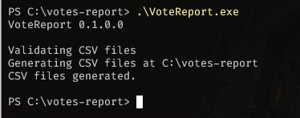

# VoteReport CLI

#### Discuss your solution’s time complexity. What tradeoffs did you make?
I'm unsure about the complexity, but I believe the complexity would be at least O(n) because the source files can grow; this way, the time required to read and process the files will increase.
  
#### How would you change your solution to account for future columns that might be requested, such as “Bill Voted On Date” or “Co-Sponsors”?
For *Bill Voted On*  I would change the file ``vote_results.csv``, adding a column ``voted_on_date`` and also the class ``VoteResult`` adding a column ``VotedOnDate``. This way we can track the votes of each Legislator. 
We could change the file ``votes.csv`` but we won't be able to track each vote. Another question that might appear would be: which date should be stored in the ``votes.csv`` file, the date of the last vote or the date of the first vote?  
For *Co-Sponsor* I would change the file ``bills.csv``, adding a column ``co_sponsor_id`` and also the class ``Bill`` adding a column ``CoSponsorId``   

#### How would you change your solution if instead of receiving CSVs of data, you were given a list of legislators or bills that you should generate a CSV for?
In the CLI application, a service was implemented to deal with query execution, validations, etc. 
To generate CSV files from lists, we would create a method in the ``VoteReportService`` class to receive a list of legislators or bills and generate the corresponding CSV files. 

#### How long did you spend working on the assignment?
One day. The solution is fully working and has a certain level of organization. Still we could work on some improvements

# Usage instructions
You can open the project in the Visual Studio, build and run the application. But in that case, the CSV source files must be located in the corresponding bin directory. Otherwise, the application won't work.  
Another option is to use the command line as follows:

You can use the parameter `--files-location` to inform where the CSV source files are located. By doing that, the output files will be generated at the same location. 

If you try to invoke without the `--files-location` parameter or try to send an empty directory, the application will try to find the CSV files in the EXE directory and generate the output files in this location. 
 

If the source CSV files can't be found in the specified directory, you will see some errors.
